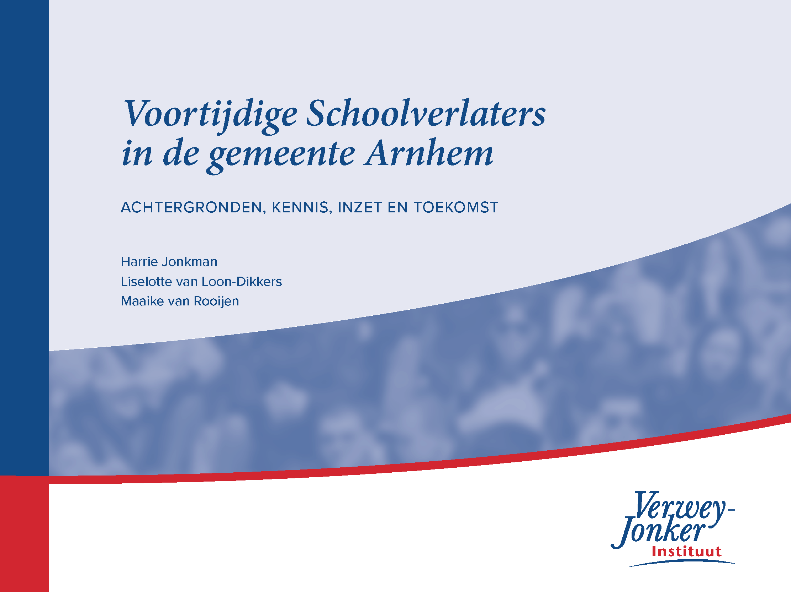

--- 
title: "Voortijdig Schoolverlaten in de gemeente Arnhem"
subtitle: "Achtergronden, kennis, inzet en toekomst"
author: "Harrie Jonkman, Liselotte van Loon-Dikkers, Maaike van Rooyen"
date: "`r Sys.Date()`"
site: bookdown::bookdown_site
documentclass: book
bibliography: [book.bib]
biblio-style: apalike
link-citations: yes
github-repo: seankross/bookdown-start
url: 'http\://seankross.com/bookdown-start/'
description: "Dit is een onderzoek naar Voortijdig Schoolverlaten in de gemeente Arnhem. Het Verwey-Jonker Instituut heeft dit onderzoek begin 2020 uitgevoerd in opdracht van de gemeente Arnhem"
---

# Inhoud {-}


```{r, echo=FALSE, out.width="50%"}


```

Ondanks investeringen vanuit de overheid is het aantal vroegtijdige schoolverlaters het afgelopen jaar gestegen. Dit zijn jongeren tot 23 jaar die geen startkwalificatie (havo-, vwo- of mbo-2 diploma) hebben gehaald en geen opleiding volgen. Het Verwey-Jonker Instituut deed in opdracht van de gemeente Arnhem onderzoek naar voortijdige schoolverlaters in Arnhem. Dit onderzoek dient als basis voor een nieuw lokaal plan dat de gemeente gaat ontwikkelen om het percentage vroegtijdige schoolverlaters in Arnhem terug te dringen. 

In het onderzoek gaan we allereerst in op de beleidscontext en cijfers omtrent voortijdig schoolverlaten (vsv). Vervolgens wordt de (internationale) literatuur over vsv erop nageslagen en zetten we op een rij wat er over de oorzaken en interventies bekend is. Ook brengen we de huidige Arnhemse inzet op vsv in kaart. We gaan in op het toekomstig vsv-beleid en geven daarbij enkele uitgangspunten die de gemeente kan gebruiken voor een toetsingskader bij het beoordelen van subsidieaanvragen voor projecten rond vsv.


Dit is een uitgave van het Verwey-Jonker Instituut.


https://www.verwey-jonker.nl/

Auteurs:

https://www.verwey-jonker.nl/over-ons/medewerkers/harrie_jonkman

https://www.verwey-jonker.nl/over-ons/medewerkers/liselotte-loon-dikkers-msc

https://www.verwey-jonker.nl/over-ons/medewerkers/maaike-van-rooijen

[Hier](https://www.verwey-jonker.nl/publicaties/2020/voortijdige-schoolverlaters-in-de-gemeente-arnhem) is het oorspronkelijke rapport te vinden. 

